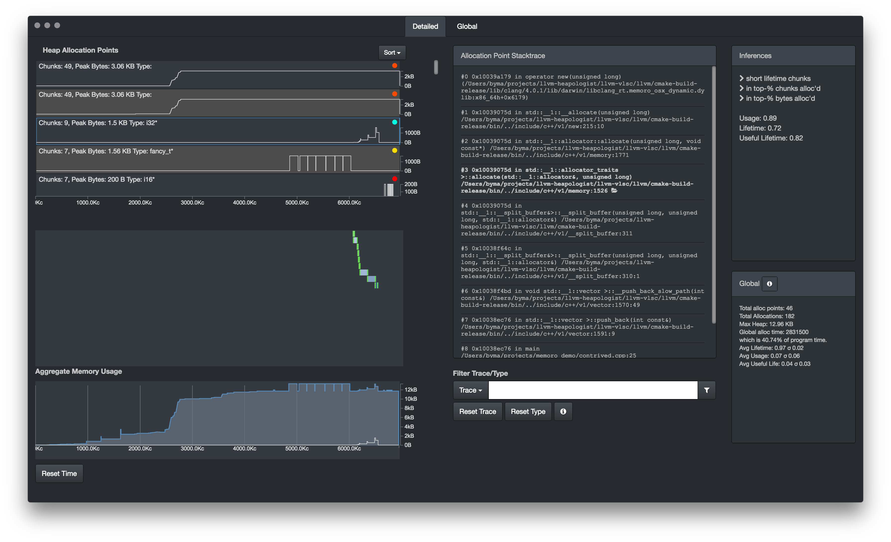

# Memoro Visualizer

Memoro is a highly detailed heap profiler. 

Memoro not only shows you where and when your program makes heap allocations, but will show you _how_ your program actually used that memory.

Memoro collects detailed information on accesses to the heap, including reads and writes to memory and when they happen, to give you an idea of how efficiently your program uses heap memory. 

Memoro includes a visualizer application that distills all this information into scores and indicators to help you pinpoint problem areas. 




# Build & Install

## Building the Instrumented compiler

First, you will need to build a local version of LLVM/Clang so you can compile your code with Memoro instrumentation. 
Pre-built releases are not yet available, but if enough people bug me perhaps I will host here. 

Follow the LLVM/Clang build instructions [here](https://releases.llvm.org/4.0.1/docs/GettingStarted.html), but use the specific repositories listed below.
Memoro is not yet in the LLVM/Clang dev branch. 

It's recommended to use the git mirror repositories instead of SVN. 
For the main LLVM repo, the Clang repo, and the CompilerRT repo, use the Memoro versions:

[LLVM](https://github.com/epfl-vlsc/llvm)

[Clang](https://github.com/epfl-vlsc/clang)

[CompilerRT](https://github.com/epfl-vlsc/compiler-rt)

These repos should default to branch r40\_dev (Memoro is based off of LLVM release\_40).
Optionally compile with libcxx and libcxxabi. 

## Building the Visusalizer C++ lib

Clone this repo with `git clone git@github.com:epfl-vlsc/memoro.git`

Enter the directory.

`$ cd memoro`

Run `npm update` to make sure all JS dependencies are present. 
You will then need to build the C++ data processing addon. 
To do this, you may first need to install `node-gyp` (`npm install -g node-gyp`)
Then, 

```bash
cd cpp
node-gyp build --release --target=1.7.9 --arch=x64 --dist-url=https://atom.io/download/electron
cd ..
```

The `target` is the electon version that must match that used to run the main app.
Adjust this if you need. 
Also adjust `arch` if you need, however I have not yet tested on non-\*nix x64 systems.
There is a Makefile as well that should work for most users. 

Obviously, you will need a C++ compiler installed for node-gyp to use. 

## Running

### Instrument and Run your Software

First, build the software you want to profile using the LLVM/Clang you have built earlier. 
Add the compiler flag `-fsanitize=memoro` to add instrumentation and optionally `-fno-omit-frame-pointer` to get nice stack traces. 
If you have a separate linking step, this may also need `-fsanitize=memoro` to ensure the Memoro/Sanitizer runtime is linked. 
It is recommended to use the LLVM symbolizer for stack traces, set env variable `MEMORO_SYMBOLIZER_PATH` to point to where `llvm-symbolizer` resides. 
Or just have it in your `PATH`. 

Run your program. After completion, the Memoro runtime will generate two files, `*.trace` and `*.chunks`. These can be opened and viewed using the visualizer. 

### Use the Memoro Visualizer

After building the C++ addon, the app can be run directly from the repo directory

```
electron .
```

File-\>Open or Cmd/Ctrl-O to open, navigate to and select either the trace or chunk file. 

Happy hunting for heap problems :-)


### Installing the Visualizer

Use `electron-packager` to gather and export all code and assets into an application package. 

```bash
electron-packager . --overwrite --platform=<platform> --arch=x64 --electron-version=1.7.9 --icon=assets/icons/icon64.icns --prune=true --out=release-builds
```

Again, adjust the platform, arch, and electron version if necessary.

# Contributing

Contributions are more than welcome. 
Please submit a pull request or get in touch. 

